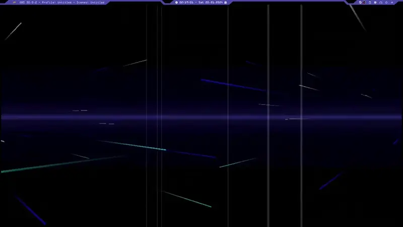

# HyprLain DotFiles


<br>
<br>


# Description:

These are my first public dotfiles. I made a design that is heavily inspired by the video game Serial Experiment Lain. This project uses some publicly available scripts and configurations from others for some functions and design elements, and you can find links to them at the bottom of the readme.

# Main programs:

- Waybar
- Hyprland
- mpvpaper

# Dependencies:

```

pavucontrol

gamescope

ttf-font-awesome

JetBrains Mono

rofi

waybar

wofi

dmenu

kitty

xdg-desktop-portal-wlr

xdg-desktop-portal-gtk

xdg-desktop-portal-hyprland

swayidle

mpvpaper

swaylock

hyprland

sox

swaync

Posy's Cursor Black

Otto (KDE Theme)

```

---
# How to install and get media files:

Copy everything inside the .config folder to your own .config folder on your system. IMPORTANT: You must replace all strings with [YOUR_PC_USER_NAME] with your PC user name. These paths are not relative paths. You will also need to configure your output, input and bindings in the hyrland config file. I marked these spots with [# ...] for you.

Soundeffects, videos and wallpapers are NOT included for copyright reasons. I REPLACED THEM WITH EMPTY DUMMY FILES! YOU NEED TO DROP IN YOUR OWN FILES! There are many ways for you to get them, but the "easiest" way to get them would be the following;

Some time ago, a webGL port of the video game Serial Experiment Lain was released. Get yourself copy or use the online version. With the source view in your browser, you can easily get the links to the sound files you want.

To get the menu background animation, start the game and use a resource downloader plugin for your browser to get the game files at runtime, then replace all png files in the folders with empty ones (It is important to format the files correctly!). In all js files you need to replace all base64-encoded png with a base64-encoded fully transparent png. Finally, import the cyan_crystal.glb into Blender, using the GLTF Importer 2.0, and put all the vertices in one place to make the blue crystals in the menu invisible and export them back into the file (Be sure to empty the Bender project before importing the GLB file). After all that, if you start the index.html from the top folder (You will need to disable your browser's security features in order to run the 
Runtime Extract version, because something, something dynamically load stuff idk.);
<br>
<br>
"flatpak run com.github.Eloston.UngoogledChromium --disable-web-security --user-data-dir=/tmp/bruh"
<br>
<br>
and go into the game, you will have a completely empty menu that you can record, cut and add a fading transition to make it loop smoothly. 
Now you can set that video as your wallpaper... or you save yourself all that work and time and just use something else, idk.

# Used and/or needed in/for this theme (thanks to all the great developers!):

- https://github.com/developer-vivek/Gruvminimal-Dots/blob/main/.config/hypr/hyprland.conf
- https://wiki.hyprland.org/Configuring/Uncommon-tips--tricks/
- https://github.com/catppuccin/catppuccin
- https://github.com/adi1090x/rofi
- https://github.com/Alexays/Waybar/issues/961#issuecomment-753533975
- http://www.michieldb.nl/other/cursors/
- https://store.kde.org/p/1358260/
- https://github.com/ad044/LainTSX/blob/master/screenshots/8.png
